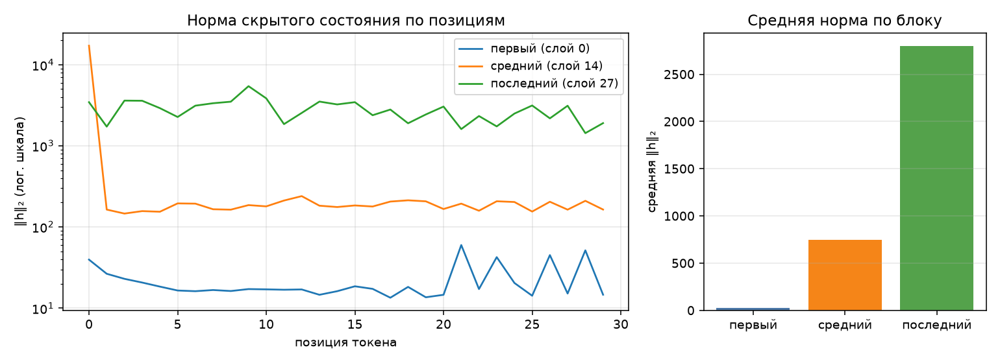

# Анатомия Qwen3-1.7B

Сгенерировано `make inspect`. dtype `bfloat16`, device `mps`.

## 1. Конфигурация

| Параметр | Значение |
|---|--:|
| слоёв | 28 |
| hidden_size | 2048 |
| intermediate_size | 6144 |
| голов запроса | 16 |
| KV-голов (GQA) | 8 |
| head_dim | 128 |
| словарь | 151 936 |
| tie_word_embeddings | True |

GQA: 16 голов запроса на 8 KV-головы — KV-cache вдвое меньше, чем при обычном multi-head.

## 2. Условия замера

| Условие | Значение |
|---|---|
| платформа | macOS-26.2-arm64-arm-64bit (Darwin 25.2.0, arm64) |
| устройство | `mps` |
| dtype | `bfloat16` |
| seq_len × batch | 256 × 1 |
| прогонов на режим | 1 |
| память измерена | `torch.mps.driver_allocated_memory` |
| RSS измерена | `ru_maxrss` |
| python | 3.12.14 |
| torch | 2.14.0 |
| transformers | 5.17.0 |
| peft | 0.21.0 |

Цифры ниже верны только для этих условий. Замер памяти без указания
устройства, dtype, длины последовательности и метрики не воспроизводится
и не сравнивается — поэтому источник метрики стоит отдельной строкой.
Сверьте, что в этой строке названа метрика, уместная для вашего
устройства, и что полученные числа с ней согласуются.

## 3. Параметры по типам модулей

| Группа | Модулей | Shape | Параметров | Доля | Разделяет тензор |
|---|--:|---|--:|--:|--:|
| `embed` | 1 | 151936×2048 | 311 164 928 | 18.08% | — |
| `q_proj` | 28 | 2048×2048 | 117 440 512 | 6.83% | — |
| `k_proj` | 28 | 1024×2048 | 58 720 256 | 3.41% | — |
| `v_proj` | 28 | 1024×2048 | 58 720 256 | 3.41% | — |
| `o_proj` | 28 | 2048×2048 | 117 440 512 | 6.83% | — |
| `gate_proj` | 28 | 6144×2048 | 352 321 536 | 20.48% | — |
| `up_proj` | 28 | 6144×2048 | 352 321 536 | 20.48% | — |
| `down_proj` | 28 | 2048×6144 | 352 321 536 | 20.48% | — |
| `norm` | 113 | 128, 2048 | 123 904 | 0.01% | — |
| `lm_head` | 1 | 151936×2048 | 0 | 0.00% | 311 164 928 |
| **итого** | | | **1 720 574 976** | 100% | |

Контроль: `sum(p.numel() for p in model.parameters())` = 1 720 574 976 — сходится с суммой по таблице.

Обратите внимание на строку `lm_head` и на значение `tie_word_embeddings`
в конфигурации: они связаны, и от этой связи зависит итог таблицы.

## 4. Нормы активаций (forward-hooks)

Промпт: «Объясни, что такое MLOps, в трёх предложениях.», 30 токенов после chat template.

| Блок | Индекс | Средняя ‖h‖₂ | Максимум |
|---|--:|--:|--:|
| первый | 0 | 22.3 | 59.9 |
| средний | 14 | 748.7 | 17134.0 |
| последний | 27 | 2795.9 | 5433.6 |

График показывает L2-норму вектора скрытого состояния для каждой позиции.
Residual-связи складывают вход блока с его преобразованием, но не гарантируют
монотонного роста нормы. По одной норме нельзя установить наличие attention sink:
для этого нужны ещё веса внимания. Логарифмическая шкала помогает видеть выбросы.

Прогон с хуками должен быть повторяемым: второй вызов в том же процессе
обязан дать те же числа и не оставить следов на модулях.

## 5. Сколько параметров добавляет LoRA

| Конфиг | Целевых модулей | Своя формула | peft | Совпало | % от базовой |
|---|--:|--:|--:|:-:|--:|
| r=8, q_proj+v_proj | 2 типов | 1 605 632 | 1 605 632 | да | 0.093% |
| r=16, все линейные | 7 типов | 17 432 576 | 17 432 576 | да | 1.013% |

Формула: `r * (in_features + out_features)` на каждый целевой `Linear` —
`A` формы `(r, in)`, `B` формы `(out, r)`, смещений нет. Расхождение с
`print_trainable_parameters()` означает ошибку в списке целевых модулей,
а не «разные способы считать».

Доля в таблице считается от базовой модели. `peft` печатает свою долю от
модели ВМЕСТЕ с адаптером, поэтому его процент чуть меньше — числитель
у обоих один и тот же.

## 6. Память в трёх режимах

Один шаг на seq_len=256, batch=1, device=mps. Метрика — аллокатор mps (`torch.mps.driver_allocated_memory`), пик за прогон; колонка «Пик RSS» снята через `ru_maxrss`.
Вход — случайные id токенов: меряется память, а не качество, и loss здесь
смысловой нагрузки не несёт (у full FT и LoRA он одинаковый, потому что
`B` в адаптере инициализирован нулями и до первого шага ничего не меняет).
Числа должны отличаться: по лекции full fine-tune стоит кратно дороже
инференса, а LoRA лежит между ними.

| Режим | Пик, МБ | Пик RSS, МБ | × к инференсу | Секунд | loss |
|---|--:|--:|--:|--:|--:|
| инференс | 4358 | 4184 | 1.00 | 2.4 | — |
| full fine-tune | 15026 | 4471 | 3.45 | 2.7 | 13.6807 |
| LoRA (r=8, q/v) | 5652 | 4469 | 1.30 | 1.7 | 13.6807 |

Прикидка из лекции: веса bf16 — 3282 МБ. Full fine-tune добавляет
градиенты (+3282 МБ) и два состояния AdamW (+6563 МБ),
то есть ×4 к весам ещё до активаций — что и видно в замере.
LoRA обучает 1 605 632 параметров вместо 1 720 574 976:
градиенты и состояния оптимизатора считаются только для адаптера, базовые
веса заморожены. Остаётся расход на активации — поэтому LoRA всё же дороже
инференса. Full fine-tune дороже LoRA в 2.66 раза.

В колонке «Пик RSS» разброс между режимами — 287 МБ на все три — и это при том, что full fine-tune обязан добавить к весам ещё 9845 МБ.
`ru_maxrss` описывает резидентную память процесса. Она не является
полным учётом выделений ускорителя, в том числе на Mac с объединённой памятью.
Поэтому RSS нельзя подставлять вместо метрики устройства.

<!-- manual-notes -->

## 7. Подробные расчёты и интерпретация

Для Qwen3-1.7B используются настройки: MPS, bf16, 256 токенов,
batch_size=1. Уменьшать последовательность не понадобилось. Числа «МБ»
в таблицах программы фактически означают МиБ: байты делятся на 1024².
Материалы лекции не приложены; ниже использована явная раскладка по тензорам
этого запуска, без предположения о наличии fp32 master weights.

### Параметры и LoRA

`lm_head.weight` использует тот же объект Parameter, что и embedding.
Поэтому его собственный вклад — 0, а переиспользуется 151936 × 2048 =
311 164 928 параметров. Без учёта связи получилось бы 2 031 739 904 вместо
1 720 574 976: завышение на 18,08%.

Q имеет 16 × 128 = 2048 выходов, K и V — по 8 × 128 = 1024.
Отсюда вдвое меньшая матрица K при одинаковом входе 2048.
MLP содержит три матрицы 2048 × 6144 в каждом из 28 блоков:
1 056 964 608 параметров (61,43%). Четыре проекции внимания вместе содержат
352 321 536 (20,48%). MLP здесь в 3 раза больше проекций внимания.
Нормализации: 56 × 128 + 57 × 2048 = 123 904 параметра.

LoRA заменяет обновление матрицы W произведением BA: A имеет размер r × in,
B — out × r. Обучаемых чисел получается r(in + out), без полной матрицы обновления.

- r=8, Q/V: 28 × 8 × [(2048 + 2048) + (2048 + 1024)] = **1 605 632**.
- r=16, семь проекций: 28 × 16 × [4096 + 3072 + 3072 + 4096 +
  8192 + 8192 + 8192] = **17 432 576**.

Оба результата совпали с peft. Доли от базовой модели — 0,0933% и 1,0132%.
`lora_alpha` равен 16 и 32 соответственно. Он меняет масштаб обновления,
а не количество параметров.

### Откуда берётся память

Веса базы: 1 720 574 976 × 2 / 1024² = **3281,736 МиБ**.
В используемом AdamW состояния exp_avg и exp_avg_sq создаются в dtype
параметров: здесь bf16. Это проверено отдельным шагом AdamW на bf16-тензоре.
Счётчик step имеет fp32 и пренебрежимо мал по сравнению с матрицами.

| Составляющая | Инференс, МиБ | Full FT, МиБ | LoRA r=8, МиБ |
|---|---:|---:|---:|
| Веса базы | 3281,736 | 3281,736 | 3281,736 |
| Веса адаптера fp32 | 0 | 0 | 6,125 |
| Градиенты | 0 | 3281,736 | 6,125 |
| Два состояния AdamW | 0 | 6563,473 | 12,250 |
| Сумма перечисленного | 3281,736 | 13126,945 | 3306,236 |

peft по умолчанию повышает точность адаптеров bf16 до fp32; поэтому на число
адаптера приходится 4 байта. База остаётся bf16. Если использовать обучение
с fp32-состояниями или master weights, оценка полного обучения будет другой.

В запуске на 1.7B пик составил 4358,5 / 15026,5 / 5652,5 МиБ
(инференс / Full FT / LoRA).
Разница с перечисленными тензорами — около 1076,8 / 1899,6 / 2346,3 МиБ.
Этот остаток нельзя назвать чистыми активациями: в него входят также временные
буферы операций, кэш аллокатора и выделения Metal. Члены достигают максимумов
в разные моменты. Например, одни выходные logits имеют 256 × 151936 чисел:
74,1875 МиБ в bf16, а их fp32-представление для loss — 148,375 МиБ.
Для точного разложения остатка потребовался бы отдельный профилировщик операций.

LoRA экономит память прежде всего за счёт отсутствия градиентов и AdamW-состояний
для 1,721 млрд базовых параметров. Активации всё ещё нужны для backward через
замороженные слои. В этом запуске LoRA экономит 62,38% пика относительно Full FT,
а Full FT требует в 3,45 раза больше памяти, чем инференс.

На MPS записан максимум `driver_allocated_memory`, опрашиваемой каждые 10 мс
и после синхронизации на границах forward, backward и optimizer.step.
Это память драйвера Metal, включая кэш, а не только живые тензоры PyTorch.
Короткий пик между опросами можно пропустить; это оценка пика, а не аппаратный
high-water mark. На CUDA используется `max_memory_allocated`, который учитывает
выделенную тензорам память PyTorch; эти две метрики не тождественны.
Каждый режим идёт в отдельном процессе, чтобы предыдущий режим не оставлял кэш.
RSS хранится отдельно. Один прогон на режим не оценивает статистический разброс.

### Активации

Средние нормы трёх выбранных блоков: 22,3 → 748,7 → 2795,9.
При этом максимумы немонотонны: 59,9 → 17134,0 → 5433,6.
Это наблюдение для одного промпта, а не общий закон роста норм в трансформере.

## 8. Четыре дефекта исходника

### 1. Жизненный цикл хуков и режим модели

**Было:** `register_forward_hook` вызывался без сохранения handle и последующего
удаления. Режим вычисления активаций не изолировался от состояния модели.
**Симптом:** каждый вызов добавлял три хука; старые замыкания и их словари
оставались доступны из модели. При train-режиме результат мог зависеть от dropout.
**Исправление:** контекстный менеджер удаляет все handles в `finally`.
На время анализа включается eval, затем восстанавливаются флаги training
всех модулей, включая смешанные состояния. Forward работает в inference_mode
без KV-cache. Проверяются два вызова, одинаковые нормы и очистка при исключении.

### 2. Двойной учёт связанных весов

**Было:** `named_parameters(remove_duplicate=False)` перечислял оба имени общего
тензора, но всем строкам назначалось `tied=False`.
**Симптом:** на выбранной 1.7B к сумме добавлялись бы лишние 311 164 928 параметров.
**Исправление:** множество `id(param)` отмечает повторные объекты. Строка lm_head
остаётся видна, но shared-веса вынесены в tied_params и не входят в сумму второй раз.
Проверка сравнивает таблицу с независимым обходом `model.parameters()`.

### 3. Снимок после вычисления вместо пика

**Было:** контекст памяти делал `gc.collect()` и один замер при выходе.
**Симптом:** временные активации уже освобождены, градиенты обнулены; максимум
во время вычислений потерян. Даже правильная метрика устройства это не исправит.
**Исправление:** CUDA сбрасывает и читает счётчик пика, MPS опрашивается в фоне
и на границах этапов с синхронизацией. Замер начинается с уже загруженных весов.

### 4. RSS вместо памяти ускорителя и загрязнение соседними режимами

**Было:** `device_allocated_bytes` всегда возвращал peak RSS процесса, независимо
от устройства. Режимы запускались последовательно в одном процессе, чей RSS-пик
не сбрасывается. Подпись «аллокатор mps» не соответствовала фактической метрике.
**Симптом:** память почти не зависела от режима, могла оказаться меньше самих весов
и различалась между отдельным probe и общим inspect.
**Исправление:** выбраны реальные API MPS/CUDA, источник пишется из результата
замера; RSS остаётся отдельной колонкой. Каждый режим и повтор запускается новым
процессом с передачей текущего конфига через stdin. Порядок Full FT > LoRA >
инференс подтверждён штатной самопроверкой на MPS.
